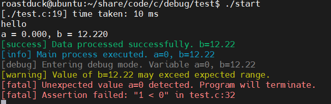

<div align="center">
  
  <h1>DebugSuite</h1>
  <span>一个轻量级且灵活的 C 项目调试和日志工具</span>
</div>
<br>
<div align="center">
  
  
</div>
<p align="center">
  <a href="../README.md">English</a> | <a href="">简体中文</a>
</p>

## 项目介绍
**DebugSuite** 是一个专为 C/C++ 项目设计的轻量级、模块化调试和日志工具。它提供了彩色日志输出、执行时间测量、值打印和断言检查等便捷的宏。DebugSuite 适用于嵌入式开发、应用调试和快速原型开发，可以轻松集成到任何 C 项目中。



## 功能特性
- 多种日志级别：debug、info、notice、warning、error、fatal、success
- 彩色格式化控制台输出，便于日志区分
- 执行时间测量宏，用于性能分析
- 方便的变量和表达式值打印
- 灵活的断言宏，提供详细的错误报告
- 最小化依赖，易于移植和扩展


## 目录结构
- `DebugSuite/`: DebugSuite 核心实现 (`debug_suite.c`、`debug_suite.h`)
- `Test/`: DebugSuite 的示例和测试代码

## 快速开始
### 1. 克隆仓库
```bash
git clone https://github.com/Rev-RoastedDuck/DebugSuite.git
cd DebugSuite
```

### 2. 构建并运行测试项目
```bash
cd Test
gcc -I../DebugSuite -o start test.c ../DebugSuite/debug_suite.c
./start
```

### 3. 集成到你的项目
- 将 `DebugSuite/` 目录下的 `debug_suite.h` 和 `debug_suite.c` 复制到你的项目中。
- 在源文件中包含 `debug_suite.h`。
- 使用提供的宏进行日志、计时和断言。

使用示例：

```c
#include "debug_suite.h"

int main(void) {
    int a = 42;
    float b = 3.14f;

    DEBUG_PRINT_INFO(1, "应用程序已启动。a=%d, b=%.2f", a, b);
    TIME_TAKEN_START(1);
    // ... 你的代码 ...
    TIME_TAKEN_END;
    DEBUG_ASSERT(a > 0);
    return 0;
}
```

## 文档
查看 [`DebugSuite/debug_suite.h`](../DebugSuite/debug_suite.h) 中的注释以获取 API 使用和宏描述。

## 许可证
本项目 **DebugSuite** 采用 Apache License 2.0 许可证发布。详情请参考 [**LICENSE**](../LICENSE)
