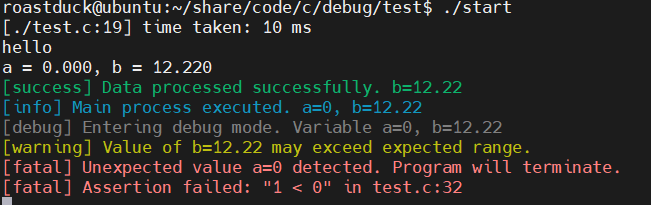

<div align="center">
  
  <h1>DebugSuite</h1>
  <span>A lightweight and flexible debugging and logging utility for C projects</span>
</div>
<br>
<div align="center">
  
  
</div>
<p align="center">
  <a href="">English</a> | <a href="./Docs/README_cn.md">简体中文</a>
</p>

## Project Introduction
**DebugSuite** is a lightweight, modular debugging and logging utility designed for C/C++ projects. It provides convenient macros for colored log output, execution time measurement, value printing, and assertion checks. DebugSuite is suitable for embedded development, application debugging, and rapid prototyping, and can be easily integrated into any C project.



## Features
- Multiple log levels: debug, info, notice, warning, error, fatal, success
- Colorful and formatted console output for easy log distinction
- Execution time measurement macros for performance profiling
- Convenient value printing for variables and expressions
- Flexible assertion macros with detailed error reporting
- Minimal dependencies, easy to port and extend


## Directory Structure
- `src/`: Core implementation of DebugSuite (`debug.c`, `debug.h`)
- `test/`: Example and test code for DebugSuite

## Quick Start
### 1. Clone the repository
```bash
git clone https://github.com/Rev-RoastedDuck/DebugSuite.git
cd DebugSuite/DebugSuite
```

### 2. Build and run the test project
```bash
cd test
gcc -I../src -o start test.c ../src/debug.c
./start
```

### 3. Integrate into your project
- Copy `debug.h` and `debug.c` from `src/` into your project.
- Include `debug.h` in your source files.
- Use the provided macros for logging, timing, and assertions.

Example usage:

```c
#include "debug.h"

int main(void) {
    int a = 42;
    float b = 3.14f;

    DEBUG_PRINT_INFO(1, "Application started. a=%d, b=%.2f", a, b);
    TIME_TAKEN_SATRT(1);
    // ... your code ...
    TIME_TAKEN_END;
    DEBUG_ASSERT(a > 0);
    return 0;
}
```

## Documentation
See the comments in [`src/debug.h`](DebugSuite/src/debug.h) for API usage and macro descriptions.

## License
This project **ModemSuite** is released under the Apache License 2.0. For details, please refer to [**LICENSE**](../LICENSE)